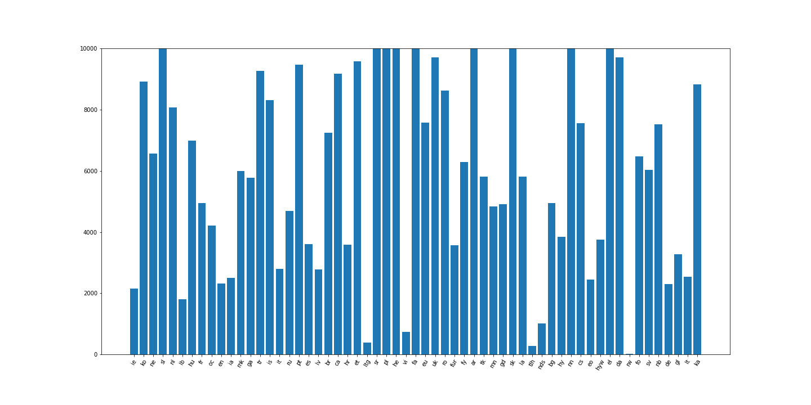

# Wordle Global

[wordle.global](https://wordle.global/)

Open Source Wordle in a bunch of languages

PULL REQUESTS WELCOME!

It would be mega awesome if you could help in any way (especially with language addition/curation).

**How to add a new language:**
1. Make a folder in webapp/data/languages/ with the language code (e.g. en, de, fr, qya, etc.)
2. Add a list of 5-letter words and call it {lang_code}_5words.txt
    1. (Optional) Add a language_config.json file
    2. (Optional) Add a list of supplemental words
3. Add your new language to the list at webapp/data/languages.json

Voilà!

## TODOs
- [ ] take into account browser bar height on mobile
- [ ] curate wordlists for existing languages
- [ ] add keyboard layouts for existing languages
- [ ] add more languages
- [ ] add "accept any word" option (useful for Klingon or other obscure languages)
- [ ] fully translate game interface (missing score streaks and options)

Potential improvements:
- [ ] nice animations for revealing letters & such
- [ ] make a 4, 6, 7 letter version
- [ ] deal with accents & character modifiers better (e.g. french is horrible right now)

Nice to haves:
- [ ] improve code quality (e.g. make variable names consistent, code more reusable & less hacky)
- [ ] properly integrate TailwindCSS and Vue.js (i.e. not from CDN)
- [ ] tests...

## Status of Languages
```  
  - Interlingue (ie):              🟨 (2147 words)
  - Korean (ko):                   🟨 (8922 words)
  - Nepali (ne):                   🟨 (2197 words)
  - Slovenian (sl):                🟨 (11731 words)
  - Dutch (nl):                    🟨 (7441 words)
  - Luxembourgish (lb):            🟨 (1752 words)
  - Hungarian (hu):                🟨 (6047 words)
  - French (fr):                   🟨 (4482 words)
  - Occitan (oc):                  🟨 (4204 words)
  - English (en):                  🟩 (12948 words)
  - Interlingua (ia):              🟨 (2476 words)
  - Macedonian (mk):               🟨 (5998 words)
  - Irish (ga):                    🟨 (5082 words)
  - Turkish (tr):                  🟨 (9224 words)
  - Icelandic (is):                🟨 (8285 words)
  - Italian (it):                  🟨 (2783 words)
  - Russian (ru):                  🟨 (4688 words)
  - Portuguese (pt):               🟨 (9016 words)
  - Spanish (es):                  🟨 (3602 words)
  - Latvian (lv):                  🟨 (2775 words)
  - Breton (br):                   🟨 (7143 words)
  - Catalan (ca):                  🟨 (9079 words)
  - Croatian (hr):                 🟨 (3591 words)
  - Estonian (et):                 🟨 (9459 words)
  - Latgalian (ltg):               🟥 (388 words)
  - Serbian (sr):                  🟨 (17968 words)
  - Quenya (qya):                  🟨 (1327 words)
  - Polish (pl):                   🟨 (10184 words)
  - Hebrew (he):                   🟨 (64540 words)
  - Vietnamese (vi):               🟧 (739 words)
  - Persian (fa):                  🟨 (11253 words)
  - Basque (eu):                   🟨 (7520 words)
  - Ukrainian (uk):                🟨 (9589 words)
  - Romanian (ro):                 🟨 (8618 words)
  - Fur (fur):                     🟨 (3569 words)
  - Western Frisian (fy):          🟨 (6095 words)
  - Arabic (ar):                   🟨 (10166 words)
  - Turkmen (tk):                  🟨 (5814 words)
  - Mongolian (mn):                🟨 (4830 words)
  - Gaelic (gd):                   🟨 (4660 words)
  - Slovak (sk):                   🟨 (10444 words)
  - Latin (la):                    🟨 (5802 words)
  - Klingon (tlh):                 🟥 (270 words)
  - Latgalian (nds):               🟨 (1001 words)
  - Bulgarian (bg):                🟨 (4953 words)
  - Armenian (hy):                 🟨 (3848 words)
  - Norwegian Nynorsk (nn):        🟨 (10523 words)
  - Czech (cs):                    🟨 (7544 words)
  - Esperanto (eo):                🟨 (2449 words)
  - Western Armenian (hyw):        🟨 (3748 words)
  - Greek (el):                    🟨 (10209 words)
  - Danish (da):                   🟨 (9516 words)
  - Kinyarwanda (rw):              🟥 (21 words)
  - Faroese (fo):                  🟨 (6448 words)
  - Swedish (sv):                  🟨 (5968 words)
  - Norwegian Bokmål (nb):         🟨 (7471 words)
  - German (de):                   🟨 (2277 words)
  - Galician (gl):                 🟨 (3269 words)
  - Lithuanian (lt):               🟨 (2004 words)
  - Georgian (ka):                 🟨 (8827 words)
```



## Credits:
- Josh Wardle (original Wordle creator)
- NYT (presumably holds the copyright or some IP rights or something with their $$$ purchase)
- Elizabeth S (inventor of the Wordle grid)
- Nadia H (my lovely beta-tester)
- Daniel Rodriguez (for some inspiration with Tailwind)

## Data sources
- https://www.nytimes.com/games/wordle/index.html - english word list
- https://github.com/wooorm/dictionaries - most other word lists ([Titus Wormer](https://wooorm.com/) is an incredible dude)
