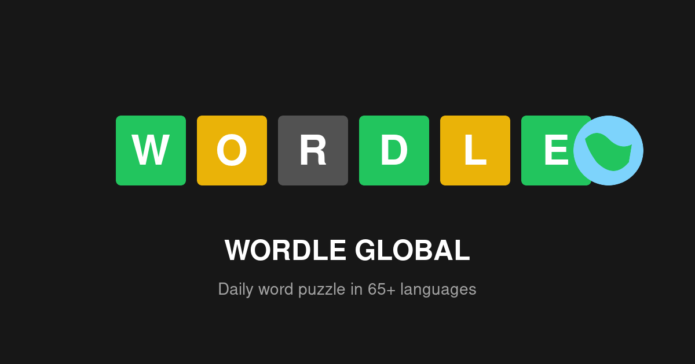

# Wordle Global

[](https://github.com/Hugo0/wordle/actions/workflows/test.yml)
[](https://wordle.global)
[](https://opensource.org/licenses/MIT)
[](https://github.com/Hugo0/wordle/pulls)



**[Play now at wordle.global](https://wordle.global/)** — the daily word guessing game in 65+ languages. Open source, community-driven, no ads.

## Languages

العربية · Azərbaycan · български · brezhoneg · català · کوردی · čeština · dansk · Deutsch · Ελληνικά · **English** · Esperanto · Español · eesti · euskara · فارسی · **Suomi** · føroyskt · français · Frysk · Gaeilge · Gàidhlig · Galego · עברית · hrvatski · magyar · Հայերեն · Interlingua · Íslenska · Italiano · ქართული · 한국어 · latine · Lëtzebuergesch · lietuvių · latviešu · Māori · македонски · Монгол · Norsk Bokmål · Plattdüütsch · नेपाली · Nederlands · Norsk Nynorsk · occitan · Palauan · polski · Português · Quenya · Română · русский · Ikinyarwanda · slovenčina · Slovenski · српски · Svenska · Türkmençe · tlhIngan · Türkçe · Українська · Tiếng Việt · [and more...](https://wordle.global)

Don't see your language? [Add it!](#add-a-new-language)

## Contribute

You don't need to be a developer to help — native speakers are the best contributors.

### Report a problem

Found a bad word, missing character, or bug? [Open an issue](https://github.com/Hugo0/wordle/issues/new) with the language and what went wrong.

### Improve a word list

Each language has a word list you can [edit directly on GitHub](https://github.com/Hugo0/wordle/tree/main/webapp/data/languages) (click any language folder, then the pencil icon on the `_5words.txt` file). Remove bad words, add missing ones, fix misspellings — GitHub will walk you through creating a pull request.

### Translate the UI

If text is showing in English when it should be in your language, edit the `language_config.json` in your language's folder on GitHub.

### Add a new language

1. Create a folder: `webapp/data/languages/{lang_code}/`
2. Add a word list: `{lang_code}_5words.txt` (one 5-letter word per line, lowercase)
3. (Optional) Add a keyboard layout, UI translations, and supplement words

See [CONTRIBUTING.md](CONTRIBUTING.md) for full details and dev setup.

## For Developers

See [CONTRIBUTING.md](CONTRIBUTING.md) for architecture, code style, and guidelines.

```bash
git clone https://github.com/Hugo0/wordle.git && cd wordle
pnpm install && pnpm dev
```

## Credits

- [Josh Wardle](https://en.wikipedia.org/wiki/Josh_Wardle) (original Wordle creator)
- [Elizabeth S](https://x.com/irihapeta) (inventor of the Wordle grid)
- [Wordles of the World](https://gitlab.com/rwmpelstilzchen/wordles) — community-sourced list of Wordle derivatives
- [wooorm/dictionaries](https://github.com/wooorm/dictionaries) — most word lists (Hunspell-based)
- [FrequencyWords](https://github.com/hermitdave/FrequencyWords) · [wordfreq](https://github.com/rspeer/wordfreq) — word frequency data
- All [contributors](https://github.com/Hugo0/wordle/graphs/contributors) and language maintainers!

## License

[MIT](LICENSE)
