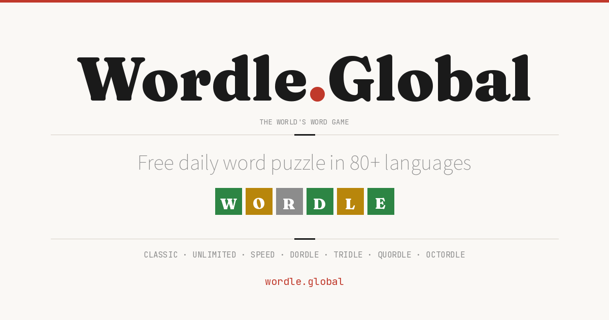

# Wordle Global

[](https://github.com/Hugo0/wordle/actions/workflows/test.yml)
[](https://wordle.global)
[](https://wordle.global/accessibility)
[](LICENSE)
[](https://github.com/Hugo0/wordle/pulls)



**[Play now at wordle.global](https://wordle.global/)** — the daily word puzzle in 80+ languages. Free, open source, community-driven. Six game modes: Classic, Unlimited, Speed Streak, Dordle, Tridle, and Quordle.

## Languages

‎العربية‎ · Azərbaycan · বাংলা · български · brezhoneg · català · ‎کوردی‎ · čeština · dansk · Deutsch · Ελληνικά · English · Esperanto · Español · eesti · euskara · ‎فارسی‎ · Suomi · føroyskt · français · Friulian · Frysk · Gaeilge · Gàidhlig · Galego · Hausa · ‎हिन्दी‎ · ‎עברית‎ · hrvatski · magyar · Հայերեն · արեւմdelays ‎ · bahasa Indonesia · Interlingua · Occidental · Íslenska · Italiano · 日本語 · ქართული · 한국어 · latine · latgaliski · latviešu · Lëtzebuergesch · lietuvių · Māori · македонски · Melayu · Монгол · मराठी · नेपाली · Nederlands · Norsk Bokmål · Norsk Nynorsk · occitan · ‎ਪੰਜਾਬੀ‎ · Palauan · Plattdüütsch · polski · Português · Quenya · Română · русский · Ikinyarwanda · shqip · slovenčina · Slovenski · српски · Svenska · Tagalog · Türkçe · Türkmençe · tlhIngan · Українська · ‎اردو‎ · Oʻzbekcha · Tiếng Việt · Yorùbá

Don't see your language? [Add it!](#add-a-new-language)

## Contribute

You don't need to be a developer to help — native speakers are the best contributors.

### Report a problem

Found a bad word, missing character, or bug? [Open an issue](https://github.com/Hugo0/wordle/issues/new/choose) — pick the right template and we'll take care of it.

### Improve a word list

Word data is managed via `words.json` files in each language folder under [`data/languages/`](https://github.com/Hugo0/wordle/tree/main/data/languages). Remove bad words, add missing ones, fix misspellings — GitHub will walk you through creating a pull request.

### Translate the UI

If text is showing in English when it should be in your language, edit the `language_config.json` in your language's folder on GitHub.

### Add a new language

1. Create a folder: `data/languages/{lang_code}/`
2. Add a `words.json` with word list data
3. Run the word pipeline: `cd scripts && uv run python -m word_pipeline run {lang_code}`
4. (Optional) Add a keyboard layout, UI translations

See [CONTRIBUTING.md](CONTRIBUTING.md) for full details and dev setup.

## For Developers

Built with **Nuxt 3** (Vue 3, Nitro server, Tailwind CSS v4). See [CONTRIBUTING.md](CONTRIBUTING.md) for architecture, code style, and guidelines.

```bash
git clone https://github.com/Hugo0/wordle.git && cd wordle
pnpm install && pnpm dev
```

## Credits

- [Josh Wardle](https://en.wikipedia.org/wiki/Josh_Wardle) (original Wordle creator)
- [Elizabeth S](https://x.com/irihapeta) (inventor of the Wordle grid)
- [Wordles of the World](https://gitlab.com/rwmpelstilzchen/wordles) — community-sourced list of Wordle derivatives
- [wooorm/dictionaries](https://github.com/wooorm/dictionaries) — most word lists (Hunspell-based)
- [FrequencyWords](https://github.com/hermitdave/FrequencyWords) · [wordfreq](https://github.com/rspeer/wordfreq) — word frequency data
- All [contributors](https://github.com/Hugo0/wordle/graphs/contributors) and language maintainers!

## License

[PolyForm Noncommercial 1.0.0](LICENSE)
